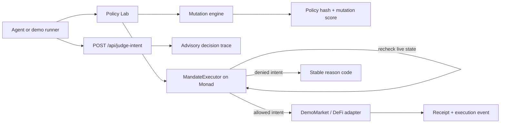

<div align="center">


# MandateLab

### Break the mandate before the agent does.

Adversarial policy testing and deterministic onchain enforcement for autonomous
trades and payments on Monad.

[Source](https://github.com/0xEmpoleon/monad-blitz-london) ·
[Live app](https://mandatelab.vercel.app) ·
[Monad explorer — pending event-window deployment](#submission-status)

</div>


## The 30-second version

An agent mandate can look safe and still contain authority bypasses. A per-action
limit does not stop split spending. A selector check does not stop target
substitution. A preview does not stop replay.

MandateLab turns those gaps into a visible, repeatable test:

1. Commit an exact policy: agent, target, selector, caps, expiry, and capital.
2. Mutate valid-looking intents into five adversarial cases.
3. Report which mutations survive and why.
4. Enforce the same policy atomically in `MandateExecutor` on Monad.

The API explains. The contract decides.

## Submission status

| Requirement | Status | Evidence |
| --- | --- | --- |
| Built from the London starter fork | Complete | Local branch preserves the starter history |
| Public source branch | Complete | `build/mandatelab-mvp` and PR #1 |
| Proper README and setup | Complete | This document |
| Working web application | Live | https://mandatelab.vercel.app |
| Contract and adversarial tests | Complete | 5 Solidity tests + 3 policy-engine tests |
| Monad deployment | Pending | Must use an event-window deployment and funded testnet key |
| Network | Selected | Monad Testnet, chain ID `10143` |

The tested source is public. Contract addresses will be published immediately
after the qualifying deployment. No address is claimed before it is verifiable.

## What makes it different

Caps, allowlists, simulations, session keys, and human approvals are useful
guardrail features. MandateLab focuses on a different product question:

> Which authority bypasses can still survive this exact mandate?

| Conventional guard | MandateLab |
| --- | --- |
| Evaluates one proposed transaction | Generates adversarial mutations of the authority itself |
| Returns a point-in-time allow/deny | Produces a reproducible mutation score and reason trace |
| May enforce a policy that was never stress-tested | Commits the tested policy hash to the same runtime rules |
| Often treats simulation as authorization | Treats the API as advisory and the contract as authoritative |
| Can miss cumulative races between individually valid actions | Accounts for epoch spend and nonce use before the external call |

The result is closer to mutation testing for financial authority than another AI
wallet or transaction firewall. See [Differentiation](./docs/DIFFERENTIATION.md)
for the competitive analysis and product boundary.

## Live demo script

The three-minute demo uses one prefilled mandate:

- one agent;
- one payable `DemoMarket.buy(bytes32)` target;
- maximum `6 MON` per action;
- maximum `10 MON` per epoch;
- `20 MON` delegated capital;
- an explicit expiry and nonce space.

Run the suite and inspect five attacks:

| Mutation | Why a naive check may allow it | MandateExecutor result |
| --- | --- | --- |
| Split-spend race | Each `6 MON` action is individually below the cap | Second action denied by `EPOCH_LIMIT` |
| Target substitution | Value and selector still look valid | Denied by `TARGET_NOT_ALLOWED` |
| Function substitution | Target and value still look valid | Denied by `SELECTOR_NOT_ALLOWED` |
| Approval replay | Original action was previously valid | Denied by `NONCE_USED` |
| Stale intent | Payload still matches the policy | Denied by `INTENT_EXPIRED` |

Then execute one safe intent and open its Monad receipt. The UI is fully usable in
deterministic local-proof mode before deployment; onchain controls activate when
the verified addresses are configured.

## Architecture



The browser and API never receive unilateral spending authority.
`executeIntent` independently rechecks policy state, marks the nonce, increments
epoch spend, and only then calls the target. If the target reverts, all state
changes roll back with the transaction.

## Why Monad

MandateLab is designed for autonomous finance, where many intents can arrive close
together and a stateful guardrail has to remain in the execution path.

- **Serially correct parallel execution.** Monad executes transactions in
  parallel while preserving the outcome of serial ordering. The executor can use
  ordinary atomic state accounting for cumulative caps rather than trusting an
  offchain race-prone counter.
- **Low-latency enforcement.** Monad documents 300 ms blocks, 600 ms finality, and
  10,000 transactions per second. A hard approval step can stay onchain without
  turning every agent action into a slow manual workflow.
- **EVM composability.** The executor binds a target and four-byte selector, so
  adapter contracts can front Monad venues using familiar Solidity, viem, and
  EVM wallets.
- **Machine payments.** The same mandate structure applies to trades,
  rebalancing, x402/MPP payments, and agent-to-agent settlement.

References: [Monad documentation](https://docs.monad.xyz/) and
[Developer Essentials](https://docs.monad.xyz/developer-essentials).

## Smart contracts

### `MandateExecutor.sol`

The security kernel provides:

- immutable policy fields and deterministic policy IDs;
- principal-funded delegated balances;
- exact agent, target, and selector binding;
- per-action and per-epoch native-value caps;
- nonce replay protection and deadlines;
- a read-only `previewIntent` path;
- checks-effects-interactions execution;
- reentrancy protection;
- rollback when the target call fails;
- stable custom-error reason codes.

### `DemoMarket.sol`

A deliberately small payable target that turns an approved payment into a visible
`Bought` event. `FailingMarket` verifies that a failed downstream call does not
consume a nonce or budget.

The contracts are an unaudited hackathon prototype, not production custody
software. See [Security model](./docs/SECURITY.md).

## API

`POST /api/judge-intent` runs the deterministic reference engine and returns a
trace. It fails closed on malformed input.

Example denial:

```json
{
  "verdict": "DENY",
  "reason": "TARGET_NOT_ALLOWED",
  "projectedSpend": "0",
  "authority": "advisory-reference-engine",
  "enforcement": "MandateExecutor.executeIntent"
}
```

The endpoint is useful to agents and UIs, but it is not an approval signature.
Only a successful onchain `executeIntent` can move value.

## Local setup

### Prerequisites

- Node.js 20 or newer
- npm
- An EVM wallet for interactive testnet use
- Testnet MON only when deploying contracts

### Install and run

```bash
git clone https://github.com/0xEmpoleon/monad-blitz-london.git
cd monad-blitz-london
npm install
cp .env.example .env.local
npm run dev
```

Open [http://localhost:3000](http://localhost:3000).

No private key is required to run the app or the mutation suite. Never commit a
deployment key and never prefix it with `NEXT_PUBLIC_`.

### Verify the build

```bash
npm run build
npm test
```

The current verification baseline is:

- production Next.js build: passing;
- policy-engine tests: 3 passing;
- contract tests: 5 passing.

## Monad Testnet deployment

Copy the example environment file and set the deployment-only values locally:

```ini
MONAD_TESTNET_RPC_URL=https://testnet-rpc.monad.xyz
DEPLOYER_PRIVATE_KEY=0x...
```

Then deploy during the Blitz event window:

```bash
npm run contracts:compile
npm run contracts:test
npm run contracts:deploy:testnet
```

Record the executor address, demo market address, deployment transactions, and
timestamps. Configure only the public addresses in the Vercel environment:

```ini
NEXT_PUBLIC_MANDATE_EXECUTOR_ADDRESS=0x...
NEXT_PUBLIC_DEMO_MARKET_ADDRESS=0x...
```

Detailed checklist: [Submission](./docs/SUBMISSION.md).

## Project structure

```text
app/                         Next.js page, styles, and JSON routes
components/MandateLabApp.tsx Interactive Policy Lab and mutation traces
contracts/                   MandateExecutor and demo targets
lib/policy.ts                Deterministic reference engine + mutations
lib/monad.ts                 Monad Testnet configuration
scripts/deploy.ts            Event-window Hardhat deployment
test/                        Solidity integration tests
docs/                        Differentiation, security, and submission pack
public/brand/                Logo and dark submission/landing header
```

## Submission documents

- [Differentiation and competitive boundary](./docs/DIFFERENTIATION.md)
- [Security model and adversarial assumptions](./docs/SECURITY.md)
- [Portal copy, links, and final submission checklist](./docs/SUBMISSION.md)
- [Build plan](./PLAN.md)

## License and disclaimer

Built for Monad Blitz London. This repository currently contains no production
audit or warranty. Use only testnet funds until the contracts have been reviewed,
tested beyond the hackathon scope, and independently audited.
